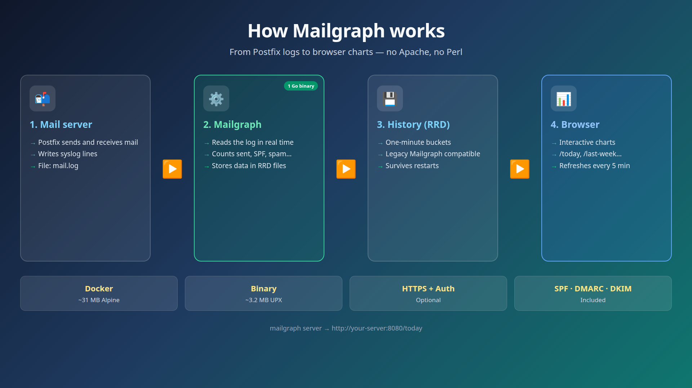

# Mailgraph (Go)

**See what happens on your mail server — in charts.** Sent and received mail, spam, viruses, SPF, DMARC, DKIM, and more.

A modern **Golang** port of [Mailgraph](https://mailgraph.schweikert.ch). One binary replaces Perl + Apache + CGI and serves **interactive** charts in the browser.

| | |
|---|---|
| **Postfix installation** | [README-POSTFIX.md](README-POSTFIX.md) — step-by-step on the server |
| **Docker image** | [Docker Hub — davidullrich/mailgraph](https://hub.docker.com/r/davidullrich/mailgraph) |

---

## How it works (overview)



1. **Postfix** (or another MTA) writes events to the log file (`mail.log`).
2. **Mailgraph** reads that log, counts events, and stores history in **RRD** files.
3. You open the **browser** and view charts by period: today, last week, last month, and so on.

No Apache, Perl, or manual PNG graph generation required.

---

## Who is it for?

- **Postfix** administrators who want to understand mail traffic on their server
- Teams migrating from classic Mailgraph who want a **lighter, modern** stack
- Anyone who prefers **Docker** and a quick setup
- Providers and companies that need optional **HTTPS** and **password-protected** dashboards

---

## Quick start with Docker

The easiest way to try it — you only need Docker and your mail server's log file.

```bash
# 1. Pull or build the image
docker pull davidullrich/mailgraph:latest
# or: make build-docker

# 2. Start the container (adjust paths for your server)
docker run --rm -d \
  --name mailgraph \
  -v /var/log/mail/mail.log:/var/log/mail/mail.log:ro \
  -v /var/data/mailgraph/rrd:/var/www/mailgraph/rrd \
  -e MAILGRAPH_SERVER_HOSTNAME=mail.yourdomain.com \
  -p 8080:8080 \
  davidullrich/mailgraph:latest

# 3. Open in your browser
# http://localhost:8080/today
```

On the **first run**, Mailgraph imports the log history automatically. After that, it tracks new events in real time.

| Mount | Purpose |
|-------|---------|
| `mail.log` (read-only) | Data source — Postfix log |
| `rrd/` directory | Persistent history storage |

---

## What you see in the dashboard

Interactive charts ([go-echarts](https://github.com/go-echarts/go-echarts)) for:

- **Sent** and **received** messages
- **Rejected**, bounced, **virus**, and **spam**
- **SPF**, **DMARC**, and **DKIM** results
- **Dovecot** logins (when applicable)

Each time period has its own page:

| Period | URL | Meaning |
|--------|-----|---------|
| **Today** | `/today` | Today since 00:00 (local time) |
| Last Day | `/last-day` | Rolling last 24 hours |
| Last Week | `/last-week` | Last 7 days |
| Last 2 Weeks | `/last-2-weeks` | Last 14 days |
| Last Month | `/last-month` | Last 31 days |
| Last 2 Month | `/last-2-month` | Last 62 days |
| Last Year | `/last-year` | Last 365 days |
| Last 2 Years | `/last-2-years` | Last 730 days |

The root `/` redirects to `/today`. The page refreshes every **5 minutes**.

---

## Before vs now

| Before (classic stack) | Now (Go) |
|------------------------|----------|
| `mailgraph.pl` + `mailgraph.cgi` | Single `mailgraph` binary |
| Apache2 | Built-in [Echo v5](https://echo.labstack.com/) |
| Static PNG graphs | Interactive browser charts |
| Debian image + Perl | **Alpine ~31 MB** + UPX binary **~3.2 MB** |

Includes the SPF / DMARC / DKIM patch by [Sebastian van de Meer](https://www.kernel-error.de/2014/04/22/mailgraph-graphen-um-spf-dmarc-und-dkim-erweitern/).

---

## Features

- Real-time log reading (`tail -f`)
- Compatible with legacy Mailgraph RRD files
- Dedicated URL per period (share links like `/last-week`)
- Optional HTTPS and HTTP Basic Auth
- Web UI at the root (`/`) — no `/mailgraph` prefix
- CSS embedded in the binary (`go:embed` in `main.go`)
- Postfix, Sendmail, Exim, Amavis, ClamAV, SpamAssassin, and more

## Tech stack

- **Go** 1.26 · **Cobra** + **Viper** · **Echo** v5 · **go-echarts** v2 · **rrdtool** · **UPX**

## Project layout

```
main.go                 # entrypoint; go:embed web/static/mailgraph.css
cmd/                    # CLI (server, cat, version, generate-config)
web/static/             # CSS and assets (embedded in the binary)
internal/               # collector, rrd, charts, web, config…
docs/screenshots/       # documentation diagrams and images
Dockerfile              # multi-stage: Go + UPX → Alpine
docker-compose.test.yml # local test container on port 8585
Makefile                # build, Docker, remote log fetch
```

---

## CLI

```bash
mailgraph server           # collector + HTTP server (Docker default)
mailgraph cat              # process the log once and exit
mailgraph version          # version and build info
mailgraph generate-config  # generate config.toml from the embedded template
```

In the container, `entrypoint.sh` runs `mailgraph server` by default.

---

## Web interface (routes)

| Route | Description |
|-------|-------------|
| `/today`, `/last-day`, … | Page with 6 charts for the period |
| `/mailgraph.css` | CSS embedded in the binary |
| `/chart?period=N&type=T` | Single chart HTML (`T` = `n`/`e`/`s`/`d`/`k`/`v`) |

Horizontal axis labels: **date and time** (`MM-DD HH:MM`, server local time).

---

## Configuration

Priority: **flags** > **`MAILGRAPH_*` env vars** > **`config.toml`** > **defaults**.

Config file search paths: `./config.toml`, `/etc/mailgraph/config.toml`, `~/.mailgraph/config.toml`

### Minimal example (`config.toml`)

```toml
[log]
file = "/var/log/mail/mail.log"
type = "syslog"
year = 2026

[rrd]
dir = "/var/lib/mailgraph/rrd"
name = "mailgraph"

[server]
listen = ":8080"
hostname = "mail.example.com"

[filter]
ignore_localhost = true
```

Generate a starter file with `mailgraph generate-config` or copy `config.toml.example`.

<details>
<summary><strong>HTTPS, Basic Auth, and environment variables</strong> (click to expand)</summary>

### HTTP Basic Auth

```toml
[auth]
enabled = true
username = "admin"
password = "secret"
realm = "Mailgraph"
```

### HTTPS (TLS)

```bash
make certs   # ssl/server.crt and ssl/server.key (local testing)

mailgraph server --listen=:8443 --tls \
  --tls-cert=ssl/server.crt --tls-key=ssl/server.key
```

Charts at **https://localhost:8443/today**

### Environment variables

| Variable | Equivalent |
|----------|------------|
| `MAILGRAPH_LOG_FILE` | `log.file` |
| `MAILGRAPH_RRD_DIR` | `rrd.dir` |
| `MAILGRAPH_SERVER_LISTEN` | `server.listen` |
| `MAILGRAPH_SERVER_HOSTNAME` | `server.hostname` |
| `MAILGRAPH_SERVER_TLS_ENABLED` | `server.tls_enabled` |
| `MAILGRAPH_AUTH_ENABLED` | `auth.enabled` |
| `MAILGRAPH_AUTH_USERNAME` | `auth.username` |
| `MAILGRAPH_AUTH_PASSWORD` | `auth.password` |

### Main flags

| Flag | Description |
|------|-------------|
| `--logfile` | Syslog mail log file |
| `--daemon-rrd` | Directory for `.rrd` files |
| `--hostname` | Name shown in chart titles |
| `--listen` | Listen address (default `:8080`) |
| `--tls` / `--tls-cert` / `--tls-key` | HTTPS |
| `--auth` / `--auth-user` / `--auth-pass` | Basic Auth |
| `--ignore-localhost` | Ignore traffic to/from `127.0.0.1` |

</details>

---

## Build

```bash
make deps          # Go modules
make build         # bin/mailgraph (~11 MB)
make build-prod    # bin/mailgraph + UPX (~3.2 MB)
make build-docker  # Docker image
make test          # go test ./...
make help
```

Requirements: Go 1.26+, `rrdtool` (runtime), `make`, UPX (optional).

---

## Docker (advanced options)

### With TLS

```bash
docker run --rm -d --name mailgraph \
  -v /var/log/mail/mail.log:/var/log/mail/mail.log:ro \
  -v /var/data/mailgraph/rrd:/var/www/mailgraph/rrd \
  -v /etc/letsencrypt/live/mail.example.com/fullchain.pem:/etc/ssl/certs/mailgraph.crt:ro \
  -v /etc/letsencrypt/live/mail.example.com/privkey.pem:/etc/ssl/private/mailgraph.key:ro \
  -e MAILGRAPH_SERVER_LISTEN=:8443 \
  -e MAILGRAPH_SERVER_TLS_ENABLED=true \
  -e MAILGRAPH_SERVER_TLS_CERT=/etc/ssl/certs/mailgraph.crt \
  -e MAILGRAPH_SERVER_TLS_KEY=/etc/ssl/private/mailgraph.key \
  -p 8443:8443 \
  davidullrich/mailgraph:latest
```

### With Basic Auth

```bash
docker run --rm -d --name mailgraph \
  -v /var/log/mail/mail.log:/var/log/mail/mail.log:ro \
  -v /var/data/mailgraph/rrd:/var/www/mailgraph/rrd \
  -e MAILGRAPH_AUTH_ENABLED=true \
  -e MAILGRAPH_AUTH_USERNAME=admin \
  -e MAILGRAPH_AUTH_PASSWORD=secret \
  -p 8080:8080 \
  davidullrich/mailgraph:latest
```

### Docker Compose

```yaml
services:
  mailgraph:
    image: davidullrich/mailgraph:latest
    hostname: mail.example.com
    restart: unless-stopped
    volumes:
      - /var/log/mail/mail.log:/var/log/mail/mail.log:ro
      - /var/data/mailgraph/rrd:/var/www/mailgraph/rrd
      - /etc/localtime:/etc/localtime:ro
    ports:
      - "8080:8080"
```

### Local testing with a remote log

```bash
make fetch-testdata TESTDATA_HOST=mx01    # saves to testdata/mail.log (gitignored)
make test-docker                          # http://127.0.0.1:8585/today
make test-docker-down
```

To reprocess the log from scratch: `rm -rf testdata/rrd/*` before starting the container.

---

## How data is updated

| Step | Interval |
|------|----------|
| Log reading | Real time (`tail -f`) |
| RRD writes | **1-minute** buckets |
| Page refresh | **5 minutes** (meta refresh) |

---

## Screenshots

### Last week


### Last month


---

## Credits

- [Mailgraph](https://mailgraph.schweikert.ch) — David Schweikert (GPL)
- SPF/DMARC/DKIM patch — Sebastian van de Meer
- Original Docker container — [David Ullrich](https://www.production-ready.de/2023/04/15/mailgraph-docker-container-en.html) ([DE](https://www.production-ready.de/2023/04/15/mailgraph-docker-container.html))
- Go port — MailgraphContainer

## License

GNU General Public License v2 — see `backups/mailgraph/COPYING` (original code).